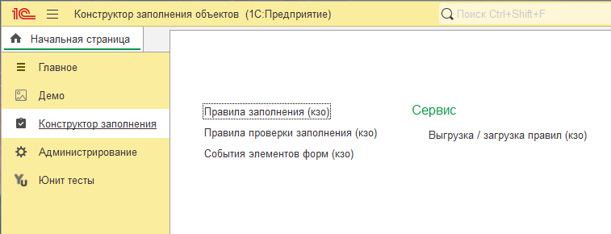
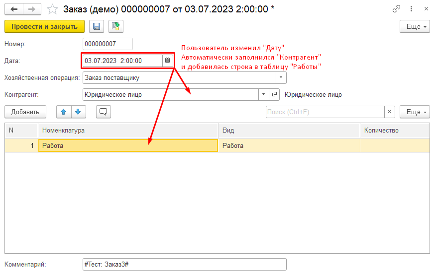
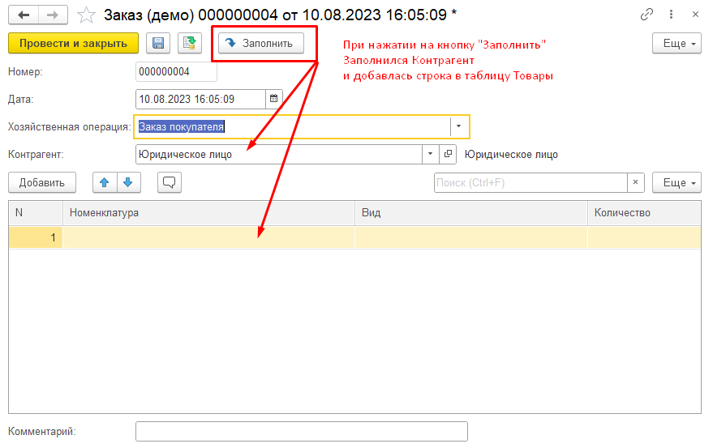
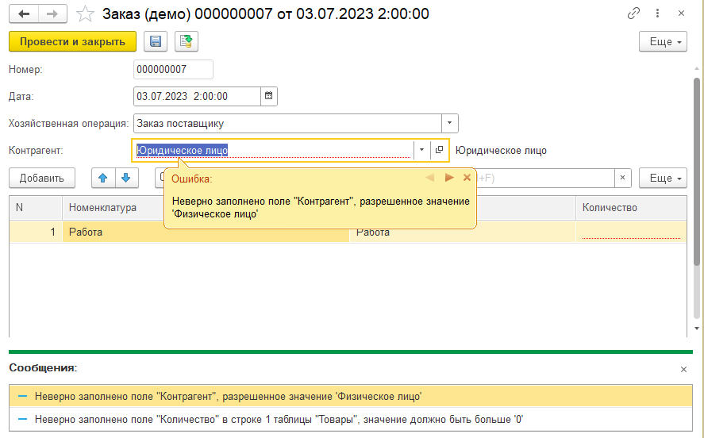

# Конфигурация "Конструктор заполнения объектов"

Версия 1.0.0.1

Конфигурация предназначена для автоматизации заполнения реквизитов объектов и контроля за правильностью заполнения пользователем.

## Основные возможности

Конфигурация позволяет ***без программирования*** настраивать автоматически выполняемые действия пользователей.

### 1. Автоматизированное заполнение

С помощью [Правил заполнения](./doc/instruction.md#31-механизм-правила-заполнения) можно настроить автоматическое заполнение указанных реквизитов при изменении родительского реквизита или при выполнении команды формы.

С помощью [Правил заполнения](./doc/instruction.md#31-механизм-правила-заполнения) можно настроить автоматическое заполнение реквизитов объекта при нажатии на кнопку "Заполнить".

### 2. Проверка заполнения

С помощью [Правил проверки заполнения](./doc/instruction.md#34-механизм-правила-проверки-заполнения) можно накладывать условия записи объекта или проведения документа.

[Подробная инструкция по установке и использованию](./doc/instruction.md) расположена в каталоге документации.