# Конфигурация "Конструктор заполнения объектов"

Версия 1.0.0.1

**Оглавление**

- [Конфигурация "Конструктор заполнения объектов"](#конфигурация-конструктор-заполнения-объектов)
	- [Термины и определения](#термины-и-определения)
	- [1. Установка и обновление](#1-установка-и-обновление)
	- [2. Интеграция](#2-интеграция)
		- [2.1 Выбор объектов для контроля и заполнения](#21-выбор-объектов-для-контроля-и-заполнения)
		- [2.2 Интеграция с БСП](#22-интеграция-с-бсп)
		- [2.3 Интеграция событий элементов форм](#23-интеграция-событий-элементов-форм)
			- [2.3.1 Событие `ПриСозданииНаСервере` формы](#231-событие-присозданиинасервере-формы)
			- [2.3.2 Область методов Конструктор заполнения](#232-область-методов-конструктор-заполнения)
	- [3. Описание работы](#3-описание-работы)
		- [3.1 Механизм "Правила заполнения"](#31-механизм-правила-заполнения)
			- [Схема процесса заполнения объекта по "Правилу заполнения"](#схема-процесса-заполнения-объекта-по-правилу-заполнения)
			- [1. Событие объекта](#1-событие-объекта)
			- [2. Подбор правил заполнения](#2-подбор-правил-заполнения)
			- [3. Фильтрация правил](#3-фильтрация-правил)
			- [4. Заполнение объекта](#4-заполнение-объекта)
		- [3.2 Подключаемые команды БСП](#32-подключаемые-команды-бсп)
		- [3.3 События элементов форм](#33-события-элементов-форм)
		- [3.4 Механизм "Правила проверки заполнения"](#34-механизм-правила-проверки-заполнения)
			- [Схема процесса проверки заполнения объекта по "Правилу проверки заполнения"](#схема-процесса-проверки-заполнения-объекта-по-правилу-проверки-заполнения)
		- [3.5 Фильтрация объектов СКД](#35-фильтрация-объектов-скд)
		- [3.6 Роли](#36-роли)
		- [3.7 Выгрузка / загрузка правил](#37-выгрузка--загрузка-правил)
			- [Режим выгрузки](#режим-выгрузки)
			- [Режим загрузки](#режим-загрузки)

## Термины и определения

**БСП** - "Библиотека специальных подсистем" компании 1С

**Конфигурация** - конфигурация "Конструктор заполнения объектов"

**Конструктор заполнения** - подсистема "Конструктор заполнения объектов" из Конфигурации

**Правило заполнения** - объект справочника "Правила заполнения (кзо)" входящий в состав конфигурации "Конструктор заполнения объектов"

**Правило проверки** - объект справочника "Правила проверки заполнения (кзо)" входящий в состав конфигурации "Конструктор заполнения объектов"

**ПВХ** - План видов характеристик - вид объекта метаданных 1С:Предприятие

## 1. Установка и обновление

Для установки конфигурации требуется:

- Выполнить сравнение и объединение Основной конфигурации 1С с файлом `1Cv8.cf` из поставки Конфигурации.
- Требуется снять все пометки объектов к объединению
- Выбрать в меню "Действия" пункт "Установить по подсистемам файла"
- Выбрать в меню "Действия" пункт "Установить по подсистемам основной конфигурации"
- Выбрать только одну подсистему `кзоКонструкторЗаполненияОбъектов`
- Нажать кнопку "Выполнить"

## 2. Интеграция

### 2.1 Выбор объектов для контроля и заполнения

После установки Конфигурации требуется настроить объекты с которыми будет работать Конструктор заполнения, для этого нужно найти следующие определяемые типы и установить в них объекты базы данных:

- `кзоОбъектыДляЗаполнения` - объекты для механизма ["Правила заполнения"](#31-механизм-правила-заполнения)
- `кзоОбъектыПроверкиЗаполнения` - объекты для механизма ["Правила проверки заполнения"](#34-механизм-правила-проверки-заполнения)
- `кзоОбъектыСобытийФорм` - объекты для механизма ["События элементов форм"](#33-события-элементов-форм)

### 2.2 Интеграция с БСП

Для корректного обновления конфигурации "Конструктор заполнения" нужно добавить подсистему в БСП, для этого добавить в методе `ПодсистемыКонфигурацииПереопределяемый.ПриДобавленииПодсистем()` следущий код:

```BSL
// КонструкторЗаполненияОбъектов.Интеграция
МодулиПодсистем.Добавить("кзоОбновлениеИнформационнойБазы");
// Конец КонструкторЗаполненияОбъектов.Интеграция
```

Для возможности использования Правил заполнения с видом события "Заполнение" при нажатии на кнопку заполнить, требуется подключить команду "Заполнить" к БСП.

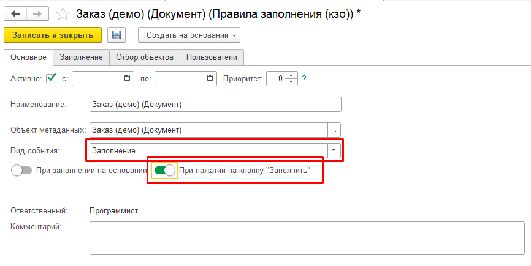

Для этого требуется в процедуру БСП `ПодключаемыеКомандыПереопределяемый.ПриОпределенииКомандПодключенныхКОбъекту()` добавить вызов метода создающего команду "Заполнить" на формах:

```BSL
// КонструкторЗаполненияОбъектов.Интеграция
кзоИнтеграция.ДобавитьКомандуЗаполнить(Источники, Команды);
// Конец КонструкторЗаполненияОбъектов.Интеграция
```

### 2.3 Интеграция событий элементов форм

Для возможности использования Правил заполнения с видом события ["Событие элемента формы"](#33-события-элементов-форм), требуется добавить код Конструктора заполнения в модуль используемой формы через расширение или напрямую в модуль формы.

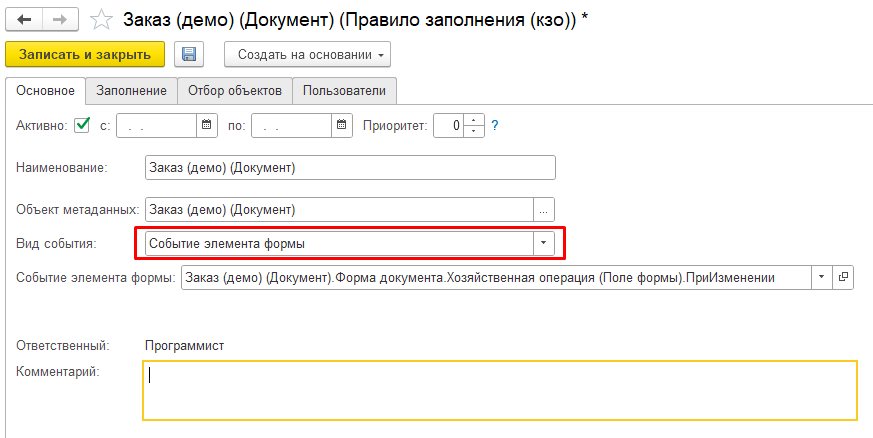

#### 2.3.1 Событие `ПриСозданииНаСервере` формы

Требуется добавить следующий блок кода в концец события формы `ПриСозданииНаСервере`:

```BSL
// КонструкторЗаполнения.ПодключаемыеКоманды
кзоИнтеграция.ПриСозданииНаСервере(ЭтаФорма);
// Конец КонструкторЗаполнения.ПодключаемыеКоманды
```

#### 2.3.2 Область методов Конструктор заполнения

Требуется разместить следующий код Конструктора заполнения в модуле формы.

```BSL
#Область КонструкторЗаполненияОбъектов

// КонструкторЗаполненияОбъектов.Интеграция

&НаКлиенте
Функция кзоПолучитьДанныеФормы() Экспорт 
	Возврат кзоПолучитьДанныеФормыНаСервере();	
КонецФункции

&НаСервере
Функция кзоПолучитьДанныеФормыНаСервере()
	Возврат кзоИнтеграция.СоздатьДанныеФормы(ЭтаФорма);	
КонецФункции

&НаСервере
Процедура кзоПодключаемый_ОбработчикНаСервере(СтруктураОбработчика)
	кзоИнтеграция.ВыполнитьОбработчик(ЭтаФорма, СтруктураОбработчика);		
КонецПроцедуры

#Область ПодключаемыеОбработчики

&НаКлиенте
Процедура кзоПодключаемый_ПриИзменении(Элемент)
	
	ИмяЭлемента = Элемент.Имя;
	ИмяСобытия = "ПриИзменении";
	СтруктураОбработчика = кзоИнтеграцияКлиентСервер.НайтиОбработчикВКешеФормы(ЭтаФорма, ИмяЭлемента, ИмяСобытия);
	
	Если СтруктураОбработчика.МоментВыполнения = ПредопределенноеЗначение("Перечисление.кзоМоментыВыполненияПодключаемыхОбработчиков.ВместоТиповогоОбработчика")
		ИЛИ НЕ ЗначениеЗаполнено(СтруктураОбработчика.ТиповойОбработчик)
		Тогда
		кзоПодключаемый_ОбработчикНаСервере(СтруктураОбработчика);
		
	ИначеЕсли СтруктураОбработчика.МоментВыполнения = ПредопределенноеЗначение("Перечисление.кзоМоментыВыполненияПодключаемыхОбработчиков.ПередТиповымОбработчиком") Тогда
		кзоПодключаемый_ОбработчикНаСервере(СтруктураОбработчика);
		Выполнить(СтруктураОбработчика.ТиповойОбработчик);	
		
	ИначеЕсли СтруктураОбработчика.МоментВыполнения = ПредопределенноеЗначение("Перечисление.кзоМоментыВыполненияПодключаемыхОбработчиков.ПослеТиповогоОбработчика") Тогда
		Выполнить(СтруктураОбработчика.ТиповойОбработчик);
		кзоПодключаемый_ОбработчикНаСервере(СтруктураОбработчика);
		
	КонецЕсли;
	
КонецПроцедуры

&НаКлиенте
Процедура кзоПодключаемый_Команда(Команда)
	
	ИмяЭлемента = Команда.Имя;
	ИмяСобытия = "Команда";
	СтруктураОбработчика = кзоИнтеграцияКлиентСервер.НайтиОбработчикВКешеФормы(ЭтаФорма, ИмяЭлемента, ИмяСобытия);
	
	Если СтруктураОбработчика.МоментВыполнения = ПредопределенноеЗначение("Перечисление.кзоМоментыВыполненияПодключаемыхОбработчиков.ВместоТиповогоОбработчика")
		ИЛИ НЕ ЗначениеЗаполнено(СтруктураОбработчика.ТиповойОбработчик)
		Тогда
		кзоПодключаемый_ОбработчикНаСервере(СтруктураОбработчика);
		
	ИначеЕсли СтруктураОбработчика.МоментВыполнения = ПредопределенноеЗначение("Перечисление.кзоМоментыВыполненияПодключаемыхОбработчиков.ПередТиповымОбработчиком") Тогда
		кзоПодключаемый_ОбработчикНаСервере(СтруктураОбработчика);
		Выполнить(СтруктураОбработчика.ТиповойОбработчик);	
		
	ИначеЕсли СтруктураОбработчика.МоментВыполнения = ПредопределенноеЗначение("Перечисление.кзоМоментыВыполненияПодключаемыхОбработчиков.ПослеТиповогоОбработчика") Тогда
		Выполнить(СтруктураОбработчика.ТиповойОбработчик);
		кзоПодключаемый_ОбработчикНаСервере(СтруктураОбработчика);
		
	КонецЕсли;
	
КонецПроцедуры

#КонецОбласти

// Конец КонструкторЗаполненияОбъектов.Интеграция

#КонецОбласти
```

## 3. Описание работы

### 3.1 Механизм "Правила заполнения"

Правила заполнения используются для автоматизации заполнения объектов, упрощения и ускорения работы пользователей. Основным объектом механизма является справочник "Правила заполнения (кзо)", объект конфигурации кзоПравилаЗаполнения.

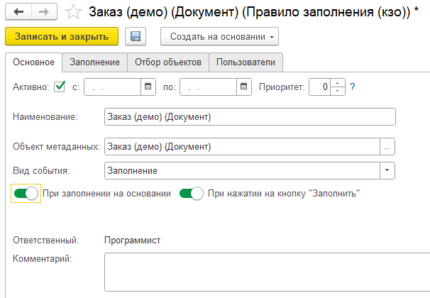

Механизм включает в себя следующие объекты конфигурации показанные на схеме ниже. Основным объектом механизма является справочник "Правила заполнения (кзо)", объект конфигурации `Спраовочник.кзоПравилаЗаполнения`.

```plantuml
@startuml
'>>> библиотека 1ce-icons-for-plantuml (ext)
!define v8_PUML https://raw.githubusercontent.com/plastinin/1ce-icons-for-plantuml/extended/dist/
!include v8_PUML/common.puml
!include v8_PUML/v8_AccRg.puml
!include v8_PUML/v8_Document.puml
!include v8_PUML/v8_Catalog.puml
!include v8_PUML/v8_InfoRg.puml
!include v8_PUML/v8_ChartsOfCharacteristicTypes.puml
!include v8_PUML/v8_DefinedTypes.puml
!include v8_PUML/v8_Enum.puml
'<<<

_Справочник(Пользователи, "Пользователи") {
}
_Справочник(ГруппыПользователей, "Группы пользователей") {
	--Состав--
	Пользователь
}
_Справочник(ИдентификаторыОбъектовМетаданных, "Идентификаторы объектов метаданных") {
}

_Справочник(кзоПравилаЗаполнения, "Правила заполнения") {
	 +ОбъектМетаданных
	 +ВидСобытия
	 +СобытиеЭлементаФормы
	 +Настройки.Отбор
	--ГруппыПользователей--
	 +Группа
	--Пользователи--
	 +Пользователь
	--Заполнение--
	 +ИмяРеквизита
	 +Значение
}
_Справочник(кзоСобытияЭлементовФорм, "События элементов форм") {
	 +ОбъектМетаданных
	 +ИмяФормы
	 +ИмяЭлемента
	 +ИмяСобытия
	 +МоментВыполнения
}
_Перечисление(кзоВидыСобытийПравилЗаполнения, "Вид события правил заполнения") {
	 +СозданиеНового
	 +Заполнение
	 +СобытиеЭлементаФормы
}
_Перечисление(кзоМоментыВыполненияПодключаемыхОбработчиков, "Моменты выполнения подключаемых обработчиков") {
	 +ПередТиповымОбработчиком
	 +ВместоТиповогоОбработчика
	 +ПослеТиповогоОбработчика
}

Пользователи --> ГруппыПользователей
Пользователи --> кзоПравилаЗаполнения
ГруппыПользователей --> кзоПравилаЗаполнения
ИдентификаторыОбъектовМетаданных --> кзоПравилаЗаполнения
кзоВидыСобытийПравилЗаполнения --> кзоПравилаЗаполнения
кзоСобытияЭлементовФорм --> кзоПравилаЗаполнения
ИдентификаторыОбъектовМетаданных --> кзоСобытияЭлементовФорм
кзоМоментыВыполненияПодключаемыхОбработчиков --> кзоСобытияЭлементовФорм
@enduml
```

#### Схема процесса заполнения объекта по "Правилу заполнения"

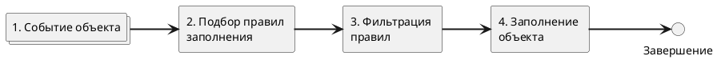

Подробное описание этапов процесса:

#### 1. Событие объекта

Это стартовая точка для запуска процесса заполнения. Все события делятся на три основных вида:

- При создании нового
- Заполнение
- Событие элемента формы

На схеме ниже показана классификация событий и механизмы реализации.

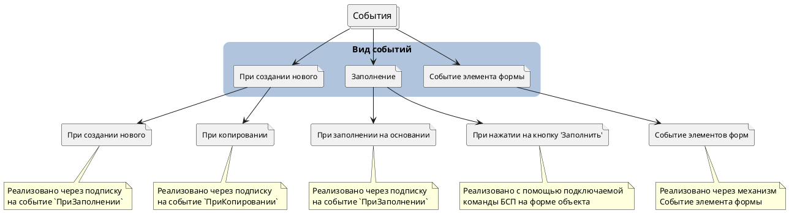

Механизмы [Подключаемых команд БСП](#32-подключаемые-команды-бсп) и [Событий элемента формы](#33-события-элементов-форм) более подробно описаны в соответствующих разделах.

#### 2. Подбор правил заполнения

Правила выбираются запросом из справочника `кзоПравилаЗаполнения` по следующим критериям:

- Активность
- Соответствие даты события периоду Правила
- Вид события
- Объект метаданных - соответствует типу заполняемого объекта
- Пользователь
- Группа пользователей

#### 3. Фильтрация правил

Для дополнительного уточнения объектов, которые нужно обрабатывать используется [механизм фильтрации объектов на базе СКД](#35-фильтрация-объектов-скд). Отборы для фильтрации можно указывать только для видов событий:

- Заполнение
- Событие элемента формы

Для остальных видов событий данный этап не выполняется.

В результате фильтрации отбрасываются правила, по которым объект заполнения не удовлетворяет отборам правила.

#### 4. Заполнение объекта

Этап заполнения состоит из шагов:

1. Правила сортируются по приоритету указанному в справочнике.

2. Заполнение значений реквизитов объекта выбранных в таблице "Заполнение" Правила.

3. В безопасном режиме выполняется программный код указанный в Правиле.

### 3.2 Подключаемые команды БСП

После [интеграции Конструктора заполнения в подключаемые команды БСП](#22-интеграция-с-бсп) при открытии формы объекта будет отрабатывать метод `кзоИнтеграция.ДобавитьКомандуЗаполнить()`, который является отправной точкой входа для вывода команды "Заполнить" на форму.


Последовательность действий программы при добавлении команды:

- Проверка типа объекта, объект должен находиться в определяемом типе `кзоОбъектыДляЗаполнения`
- Поиск наличия Правил заполнения по объекту
- Добавление команды на форму

Обработчик размещенной команды "Заполнить" запускает стандартный [механизм Правила заполнения](#31-механизм-правила-заполнения).

### 3.3 События элементов форм

После [интеграции Конструктора заполнения в формы объектов](#23-интеграция-событий-элементов-форм) для этих объектов появляется возможность создавать элементы справочника "События элементов форм (кзо)" (объект конфигурации `Справочник.кзоСобытияЭлементовФорм`)

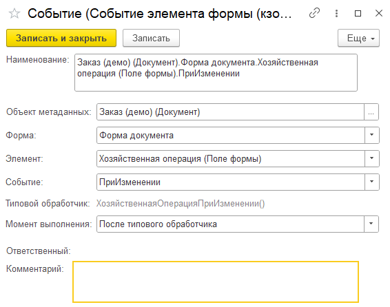

Элемент справочника имеет следующие реквизиты:

- **Объект метаданных** - тип объекта конфигурации. Список выбора объектов метаданных формируется из определяемого типа Конфигурации `кзоОбъектыСобытийФорм`.  
- **Форма** - имя формы объекта конфигурации. В список выбора добавляются только основные формы объектов (Форма элемента, Форма документа...). Если в модуль формы не добавлены методы интеграции, форма не доступна для выбора.  
- **Элемент** - имя элемента управления формы. В список выбора добавляются только элементы с типами: `КнопкаФормы`, `ПолеФормы` (привязанное к реквизиту объект формы), прочие элементы будут не доступны.  
- **Событие** - имя события выбранного элемента формы. Список событий заполняется, если для элемента доступны события: `ПриИзменении`, `Команда`, остальные события игнорируются. В поле "Типовой обработчик" устанавливается обработчик выбранного события, если он предусмотрен в конфигурации.
- **Момент выполнения** - определяет последовательность выполнения Типового обработчика и переопределяемого обработчика события.

```html
ВНИМАНИЕ! Для устранения дублирования в справочнике запрещено создавать обработчики с одинаковыми реквизитами: Объект метаданных, Имя формы, Имя элемента, Имя события.
```

Для получения информации о реквизитах и элементах выбранной формы программа вызывает экспортную функцию `кзоПолучитьДанныеФормы()` добавленную в модуль в формы в [процессе интеграции](#23-интеграция-событий-элементов-форм), это стартовая точка процесса подмены типовых обработчиков, показанная на схеме ниже.

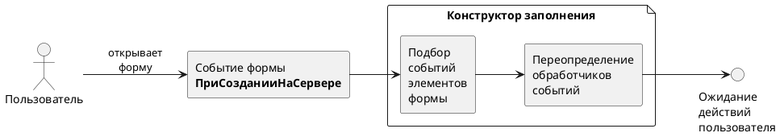

После открытия формы пользователем программа ожидает вызов переопределенного обработчика и выполняет действия по алгоритму ниже.

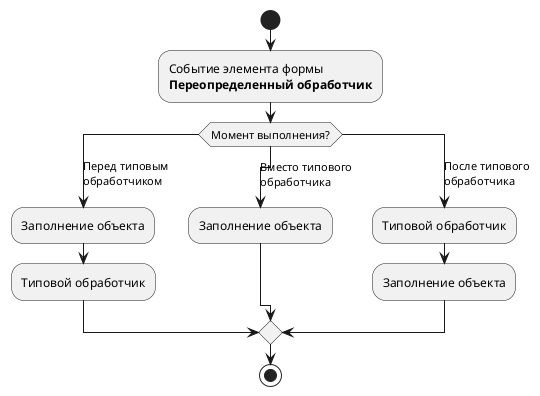

### 3.4 Механизм "Правила проверки заполнения"

Правила проверки служат для контроля правильности заполнения объекта пользователем и отображения ошибок в заполнении. Основным объектом механизма является справочник "Правила проверки заполнения (кзо)", объект конфигурации `кзоПравилаПроверкиЗаполнения`.


Реквизиты вкладки "Основное":

- **Активно и период действия** - интервал работы правила.
- **Объект метаданных** - тип объекта конфигурации. Список выбора объектов метаданных формируется из определяемого типа Конфигурации `кзоОбъектыСобытийФорм`.
- **Таблица объекта** - имя таблицы выбранного объекта
- **Только для новых объектов** - если установлен флаг, то проверка заполнения будет производиться только для новых элементов справочников, ПВХ, и для **всех документов**.

На вкладке "Проверка заполнения" заполняются указываются реквизиты и их значения, которые нужно проверять при проверке.

На вкладке "Отбор объектов" заполняются правила отбора объектов обрабатываемых правилом, если объект не соответствует отбору, то он пропускается, правило для него не будет применяться.

На вкладке "Пользователи" заполняются пользователи и группы пользователей для которых будет применяться правило.

Основные объекты Конфигурации участвующие в работе Правил проверки изображены на диаграмме ниже.

```plantuml
'>>> библиотека 1ce-icons-for-plantuml (ext)
!define v8_PUML https://raw.githubusercontent.com/plastinin/1ce-icons-for-plantuml/extended/dist/
!include v8_PUML/common.puml
!include v8_PUML/v8_AccRg.puml
!include v8_PUML/v8_Document.puml
!include v8_PUML/v8_Catalog.puml
!include v8_PUML/v8_InfoRg.puml
!include v8_PUML/v8_ChartsOfCharacteristicTypes.puml
!include v8_PUML/v8_DefinedTypes.puml
!include v8_PUML/v8_Enum.puml
'<<<

_Справочник(ГруппыПользователей, "Группы пользователей") {
	--Состав--
	 +Пользователь
}
_Справочник(ИдентификаторыОбъектовМетаданных, "Идентификаторы объектов метаданных") {
}
_Справочник(кзоПравилаПроверкиЗаполнения, "Правила проверки заполнения &#40;кзо&#41;") {
	 +ОбъектМетаданных
	 +ИмяТаблицы
	 +Настройки.Отбор
	--ГруппыПользователей--
	 +Группа
	--Пользователи--
	 +Пользователь
}
_Справочник(Пользователи, "Пользователи") {
	
}
Пользователи --> ГруппыПользователей
кзоПравилаПроверкиЗаполнения --> ИдентификаторыОбъектовМетаданных
Пользователи --> кзоПравилаПроверкиЗаполнения
ГруппыПользователей --> кзоПравилаПроверкиЗаполнения
```

#### Схема процесса проверки заполнения объекта по "Правилу проверки заполнения"

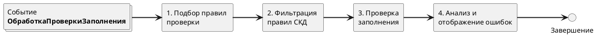

### 3.5 Фильтрация объектов СКД

Фильтрация объектов СКД - универсальный механизм применяемый для отбора неподходящих объектов конфигурации к которым не нужно применять правила. Фильтрация выполняется в соответствии с настройками отборов схемы компоновки данных.

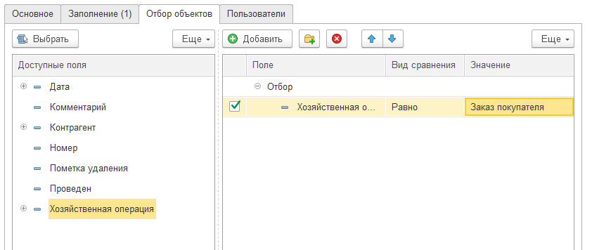

В ходе фильтрации отбрасываются объекты которые не соответствуют выбранным отборам СКД.

### 3.6 Роли

В конфигурации добавлена роль **Администратор (кзо)**, которая дает права на полный доступ и управление подсистемой Конструктора заполнения. Пользователи не обладающие этой ролью не получат доступ к подсистеме, но подсистема будет работать в соответствии с текущими настройками: будут заполняться объекты и производиться проверки.

### 3.7 Выгрузка / загрузка правил

Конфигурация предоставляет обработку выгрузки / загрузки правил (далее **Обработка**) между информационными базами или внутри одной базы. Данная обработка позволяет организовать процесс создания и отладки Правил на тестовой базе данных и выгрузку отлаженных Правил в рабочую базу данных.

Обработка работает в двух режимах: выгрузки и загрузки. Переключение осуществляется через подменю "Режим"

#### Режим выгрузки

Последовательность шагов:

1. Выбрать **Имя файла** в который будут выгружены правила.
2. Самостоятельно заполнить список правил к выгрузке или воспользоваться кнопкой **Заполнить**. Кнопка Заполнить получает все элементы справочников "Правила заполнения (кзо)" и "Правила проверки заполнения (кзо)", которые без пометки на удаление и имеют флаг "Активно".
3. Нажать кнопку **Выгрузить**

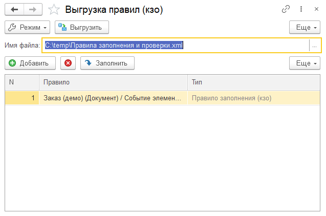

Вместе с Правилами заполнения выгружаются также указанные в них События элементов форм для поддержания ссылочной целостности.

#### Режим загрузки

Последовательность шагов:

1. Выбрать **Имя файла** правил для загрузки.
2. Установить переключатель **Загружать не активными**, если требуется дополнительная проверка загружаемого правила перед активацией.
3. Нажать кнопку **Загрузить**

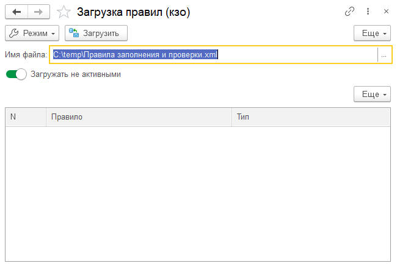

После загрузки ссылки на загруженные правила будут показаны в таблице правил.
